# Lark

## Overview

**This profile is supported by:** https://github.com/nick-frischkorn/lark_poseidon

This is a Mythic C2 Profile called lark. It provides a way for agents to communicate via Feishu APIs. This profile supports:

* Kill Dates
* Sleep Intervals
* Message Encryption

The c2 profile has `mythic_c2_container==0.0.23` PyPi package installed and reports to Mythic as version "4". 

## How To Install

- `sudo ./mythic-cli install github https://github.com/nick-frischkorn/lark_c2`

- `sudo ./mythic-cli install folder /path/to/lark/`

See https://docs.mythic-c2.net/installation#installing-agents-c2-profiles for more information

## Lark C2 Workflow

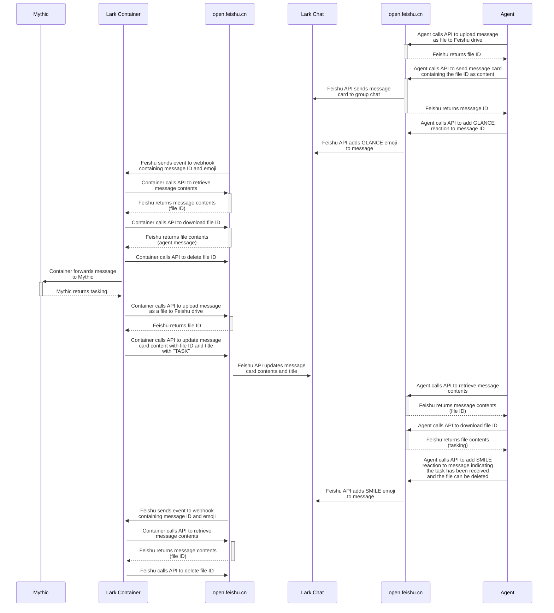

## Configuring The Profile Container

The C2 profile handles configuration using a `config.json` file which can be modified within the Mythic instance. It contains 6 parameters:

- lark_groupchat_name
- lark_app_id
- lark_app_secret
- lark_verification_token
- lark_encrypt_key
- port

Browse to C2 Profiles, then click on the dropdown arrow next to `Start Profile`, then click `View/Edit Config` to change the above values.

## Lark C2 Profile Setup

1. Sign in to larksuite and browse to https://open.larksuite.com/app?lang=en-US

2. Select `Custom Apps`, then `Create Custom App`

    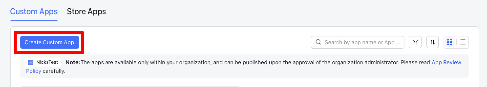

3. Choose a name and description, then select `Create`

    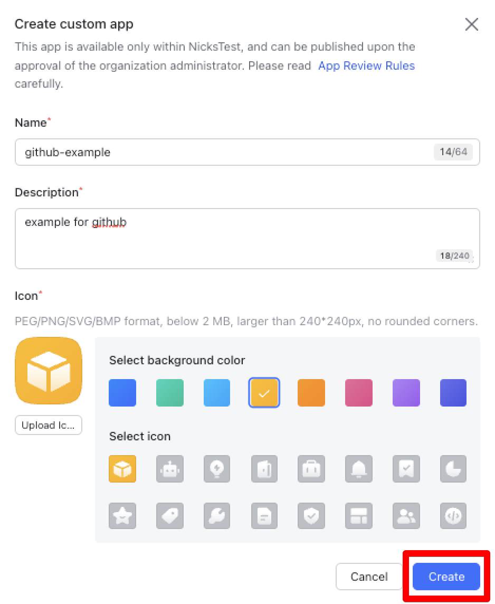

4. Select `Add Features` on the left hand panel, then select `By Feature`, then select `Add` under `Bot`

    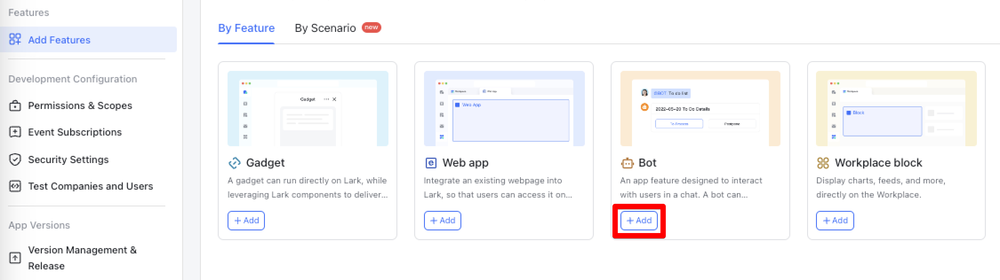

5. Select `Permissions & Scopes` on the left hand panel, then add the `im:chat`, `im:message`, `drive:file`, and `drive:drive` scopes, and select `Add in bulk`

    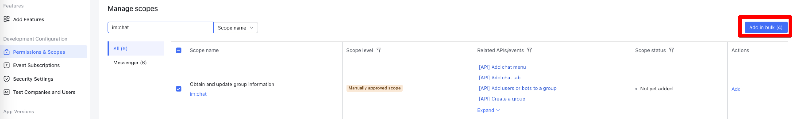

6. Select `Confirm and go to create app version`, then select `Create a version`

    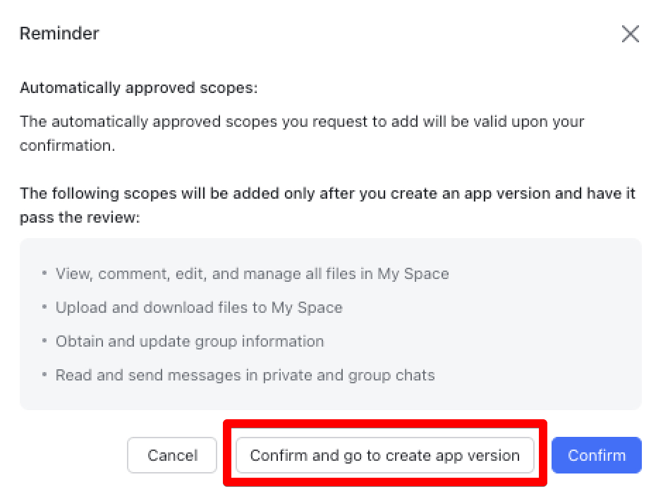

    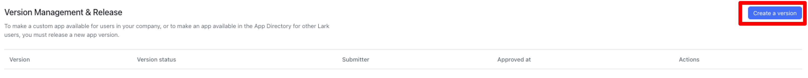

7. Fill out the version details, then select `Save`

    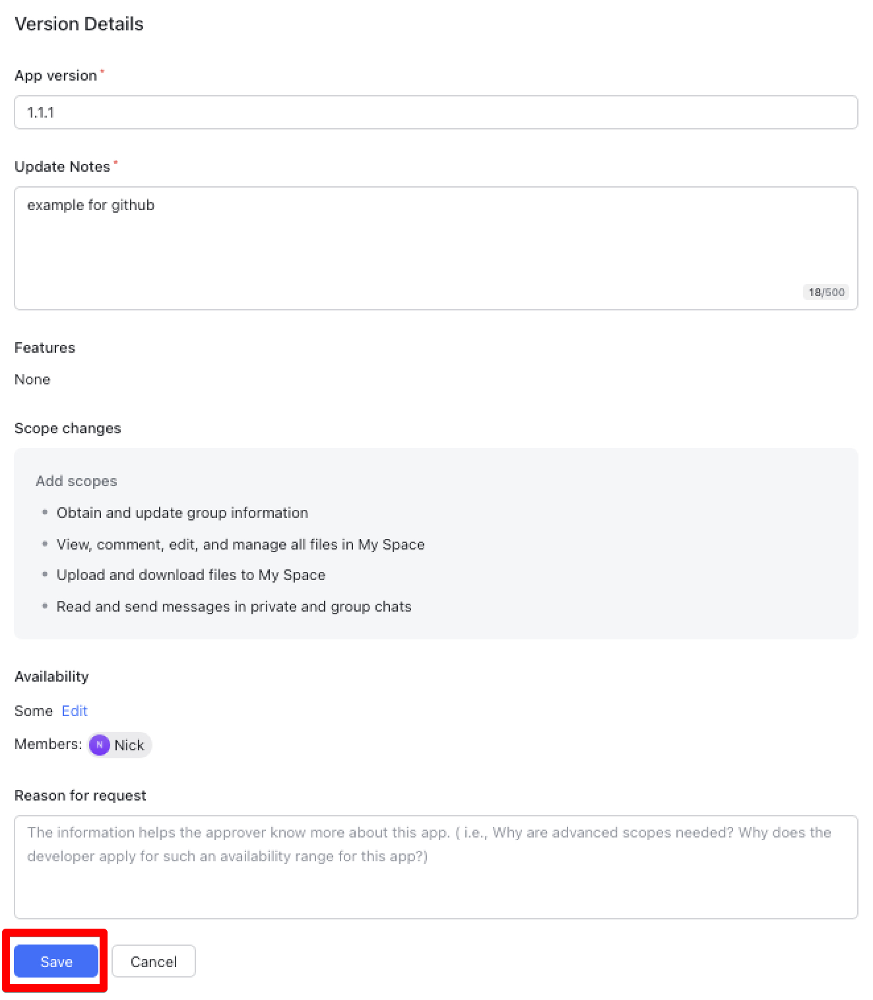

8. Select `Submit for release`

    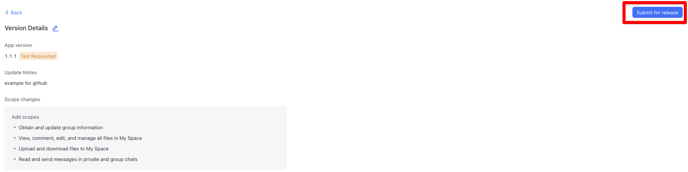

9. The Open Platform Assistant will send you a message within your larksuite tenant, select `Admin Console` to navigate to the review page

    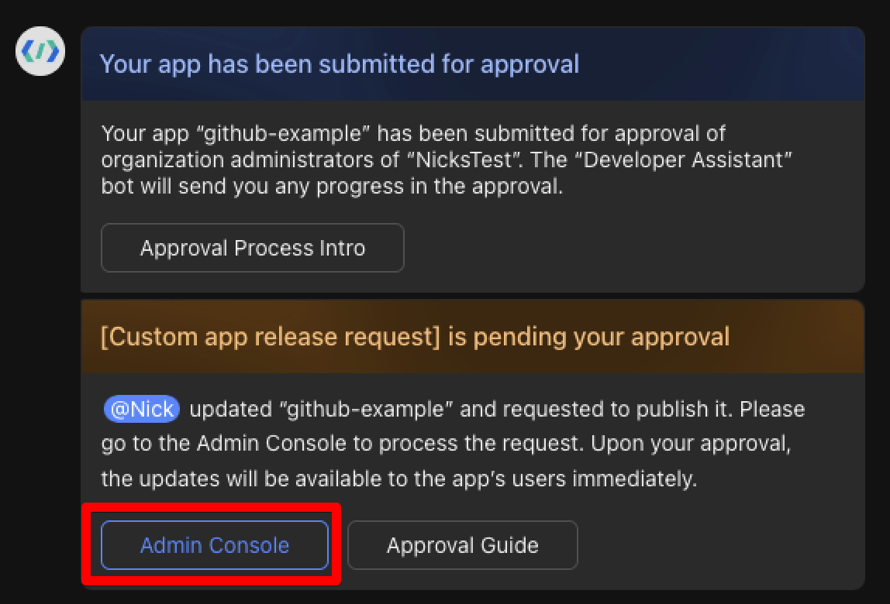

10. Select `Review` next to your bot, then `Approve`

    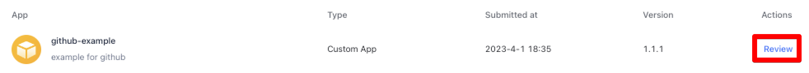

11. Create a groupchat within Lark, select `Settings`, then select `Bots`, then select `Add Bot` and choose your Lark bot

    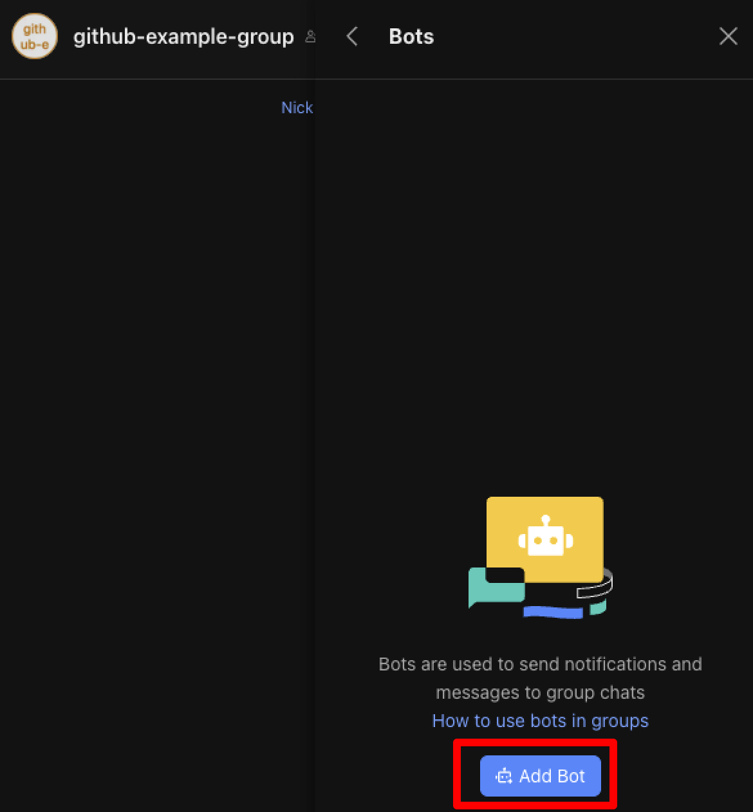

12. Navigate back to the developer console and select `Credentials & Basic Info` on the left hand panel and copy your `App ID` and `App Secret`

    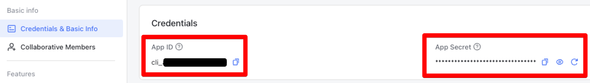

13. Select `Event Subscriptions` on the left hand panel and copy your `Verification Token` 

    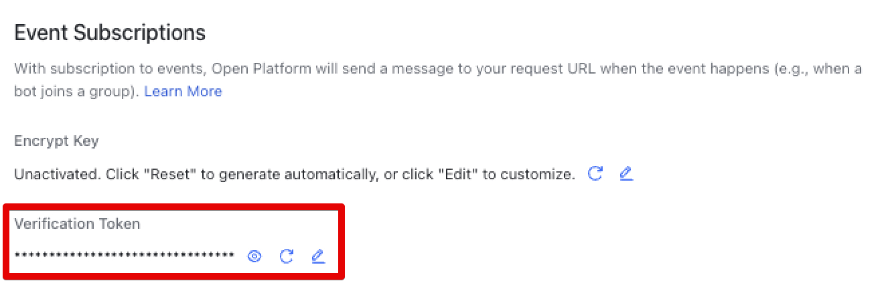

14. Within Mythic, update lark's C2 profile with your obtained `Verification Token`, `App ID`, `App Secret`, and the name of the groupchat you added the bot to, then start the profile.

15. Navigate back to the `Event Subscriptions` panel, configure the `Request URL` to point to Mythic's IP and `port` from the config file, then select `Save`

    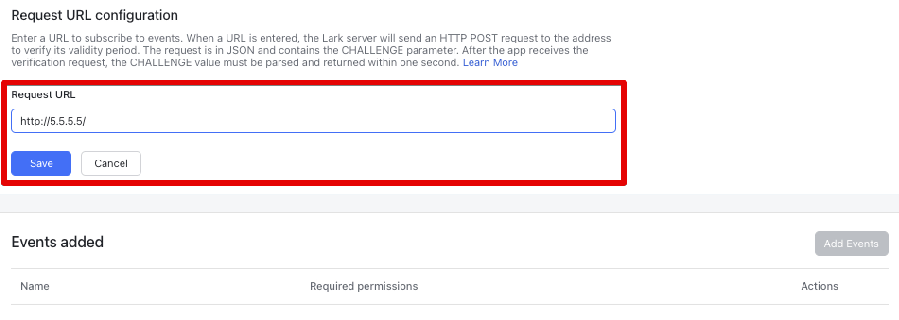

16. Once the `Request URL` has received the verification event, select `Add Events`, then select `reaction.created`

    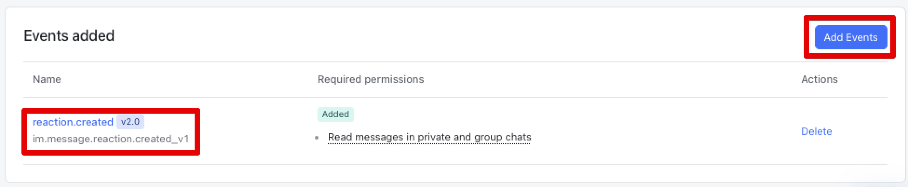

## To Do

- Upgrade server to be async + support HTTPS
- Add Lark event encryption option
- Add agent file upload/download capabilities
- Add command to switch to regular HTTP beaconing
